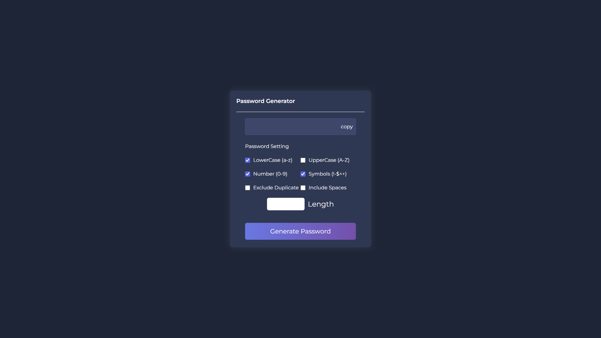

# 🔐 Password Generator

A dynamic and secure password generator web app built using **HTML**, **CSS**, and **JavaScript**.  
Generate strong passwords with options for including uppercase, lowercase, numbers, and symbols, all with a modern and responsive interface.

---

## 🚀 Live Demo

🌐 [View Live](https://codebyabdo.github.io/Password-Generator/)

---

## 📸 Screenshot

 <!-- Replace with an actual screenshot if available -->

---

## ✨ Features

- Generate secure, random passwords  
- Options to include uppercase, lowercase, numbers, and symbols  
- Copy password to clipboard with a single click  
- Responsive design for mobile and desktop views  
- Clean and modern UI with smooth interactions

---

## 🛠 Tech Stack

- HTML5  
- CSS3  
- JavaScript (Vanilla)

---

## 📦 Getting Started

To run the project locally:

```bash
git clone https://github.com/abd-el-rahman-adel-dev/Password-Generator.git
cd Password-Generator
open index.html
```

Or just double-click `index.html` in your file manager.

---

## 📁 Project Structure

```
📦 Password-Generator
┣ 📂 css
┃ ┗ 📜 style.css
┣ 📂 images
┣ 📜 index.html
┣ 📜 script.js

```

---

## 📄 License

This project is licensed under the [MIT License](./LICENSE).

---

## 🙋‍♂️ Author

- [Abd El-Rahman Adel](https://github.com/codebyabdo)
- [LinkedIn](https://www.linkedin.com/in/codebyabdo)

---

> ⭐ If you find this project useful, please consider starring the repository!
